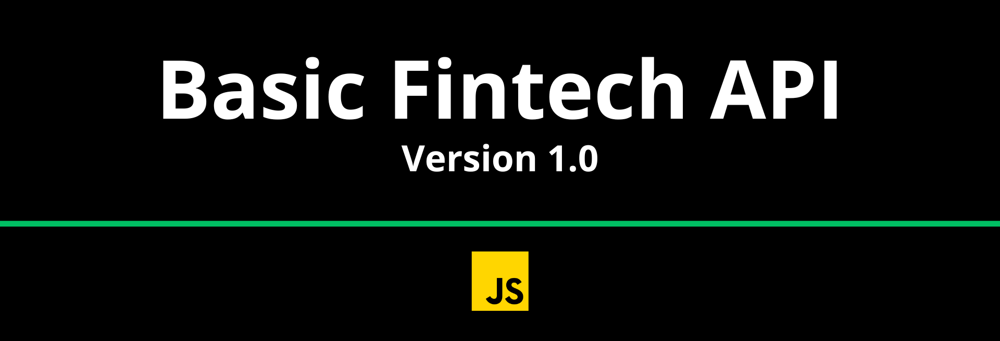

Esse projeto tem por finalidade melhorar a, cada versão, uma API simples de um Fintech.

Para cada versão será adicionado novas ferramentas e complexidade em sua infraestrutura. Os projetos funcionarão apenas na sua máquina local.

## Funcionalidades

- Criar uma conta
- Buscar o extrato bancário do cliente
- Realizar um depósito
- Realizar um saque
- Buscar o extrato bancário do cliente por data
- Atualizar dados da conta do cliente
- Obter dados da conta do cliente
- Desativar uma conta

### Regras de negócio

- Não deve ser possível cadastrar uma conta com CPF já existente
- Não deve ser possível buscar extrato em uma conta não existente
- Não deve ser possível fazer depósito em uma conta não existente
- Não deve ser possível fazer saque em uma conta não existente
- Não deve ser possível fazer saque quando o saldo for insuficiente
- Não deve ser possível excluir uma conta não existente
## Executar localmente

Clone o projeto

```bash
  git clone https://github.com/Amosao/basic-finAPI.git
```
> Dê checkout para a branch "v1.0"

Vá para o diretório do projeto

```bash
  cd basic-finAPI
```

Instale as dependências

```bash
  npm install
```

Inicie o server

```bash
  npm start
```

### Observações

- A API rest pode ser acessada pela porta 8080;
- O projeto não possui conexão com banco dados nesta versão;
- O projeto utiliza o [Nodemon](https://www.npmjs.com/package/nodemon) como ferramenta de execução;
- Importe o arquivo 'requests.json' no [Insomnia](https://insomnia.rest/) para ter todas as requisições configuradas;

## Autores

- [@Amosao](https://github.com/Amosao)

